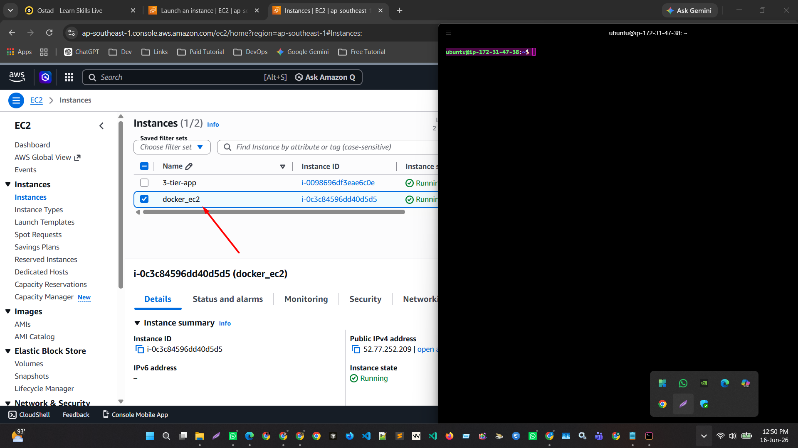
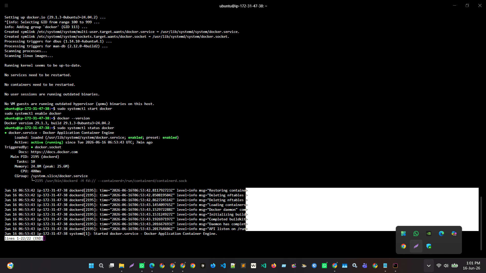
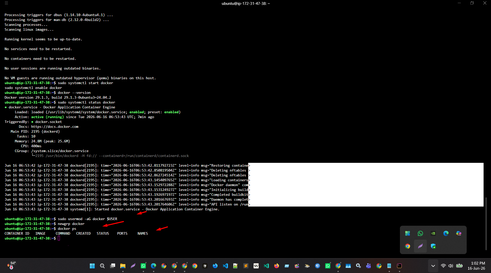
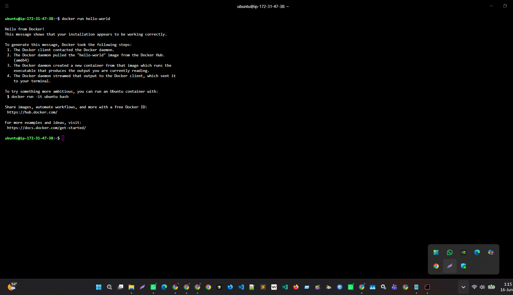
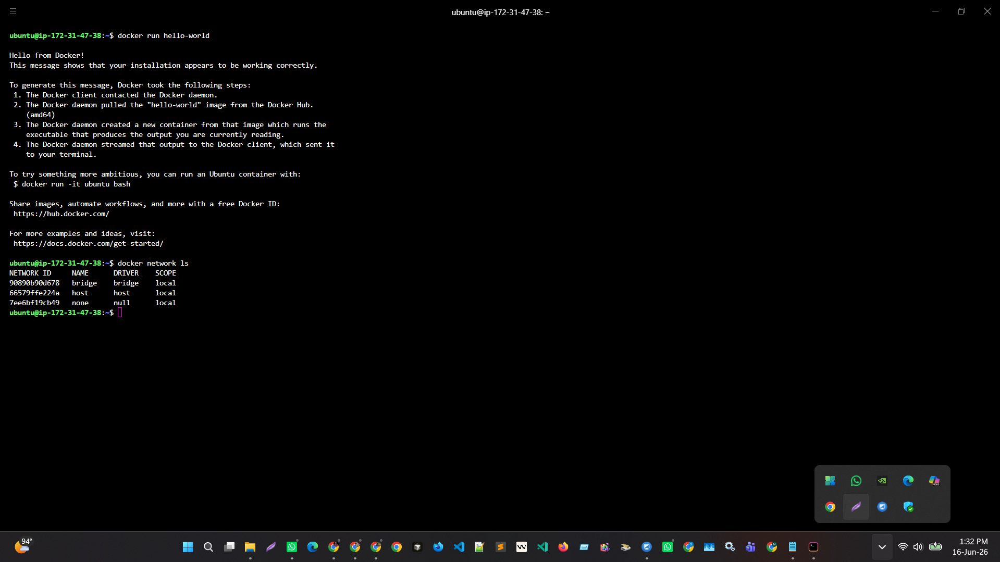
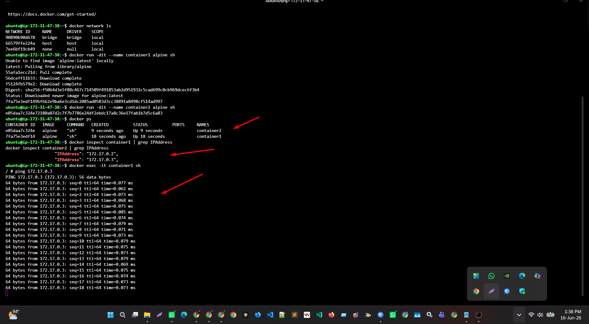
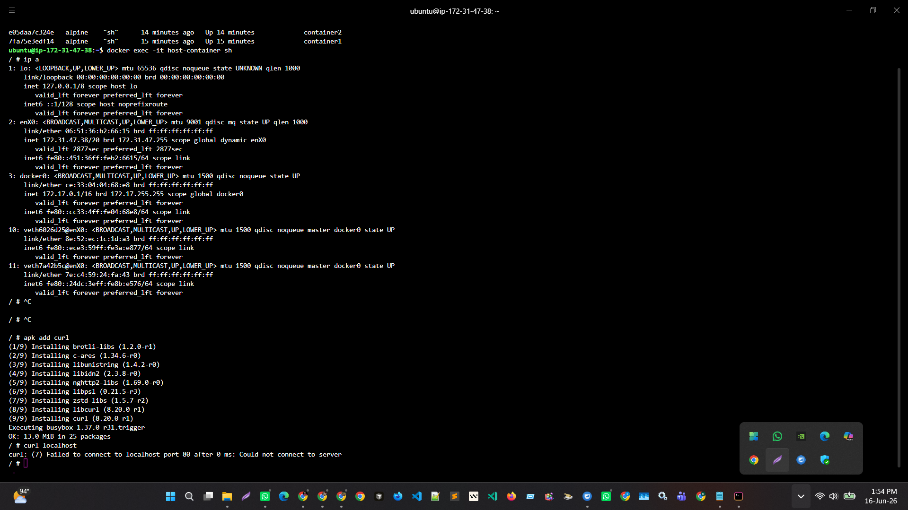
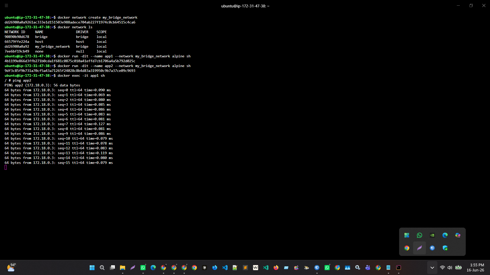

# 🐳 Module 9 Assignment  
## Docker Installation and Networking on AWS EC2

---

## Details
- Course: DevOps Module 9  
- Topic: Docker Installation and Networking on AWS EC2  
- Platform: AWS EC2 (Ubuntu 22.04)

---

# 🎯 Objective

This assignment demonstrates Docker installation, configuration, and networking concepts using AWS EC2.

---

# 🖥️ Step 1 — EC2 Setup & SSH Connection

AWS EC2 Ubuntu instance was created and connected via SSH:

```bash
ssh -i key.pem ubuntu@52.77.252.209
```

---

# ⚙️ Step 2 — Docker Installation

```bash
sudo apt update && sudo apt upgrade -y
sudo apt install docker.io -y
sudo systemctl start docker
sudo systemctl enable docker
```

---

# 🔐 Step 3 — Docker Permission Setup

```bash
sudo usermod -aG docker $USER
newgrp docker
```

---

# 🧪 Step 4 — Hello World Test

```bash
docker run hello-world
```

---

# 🌐 Step 5 — Docker Networks

```bash
docker network ls
```

---

# 🔵 Step 6 — Bridge Network

```bash
docker run -dit --name container1 alpine sh
docker run -dit --name container2 alpine sh

docker inspect container1 | grep IPAddress
docker exec -it container1 sh
ping <container2-ip>
```

---

# 🟢 Step 7 — Host Network

```bash
docker run -dit --name host-container --network host alpine sh
ip a
```

---

# ⚫ Step 8 — None Network

```bash
docker run -dit --name none-container --network none alpine sh
docker exec -it none-container sh
apk add curl
curl google.com
```

Expected: No internet access

---

# 🟣 Step 9 — Custom Bridge Network

```bash
docker network create my_bridge_network

docker run -dit --name app1 --network my_bridge_network alpine sh
docker run -dit --name app2 --network my_bridge_network alpine sh

docker exec -it app1 sh
ping app2
```

---

# 📊 Summary

| Network | Type | Use |
|--------|------|-----|
| Bridge | Default | Container communication |
| Host | Direct | High performance |
| None | Isolated | No network |
| Custom Bridge | Advanced | DNS-based communication |

---

# 📸 Screenshots

All screenshots are stored in:
screenshots/ folder in this GitHub repo.

---

## Docker Installation



## Hello World


## Networks


## Bridge Network


## Host Network


## None Network


## Custom Bridge Network


---

# 📌 EC2 IP USED
52.77.252.209

---

# ✅ Conclusion

Docker was successfully installed and all networking modes were tested on AWS EC2.
